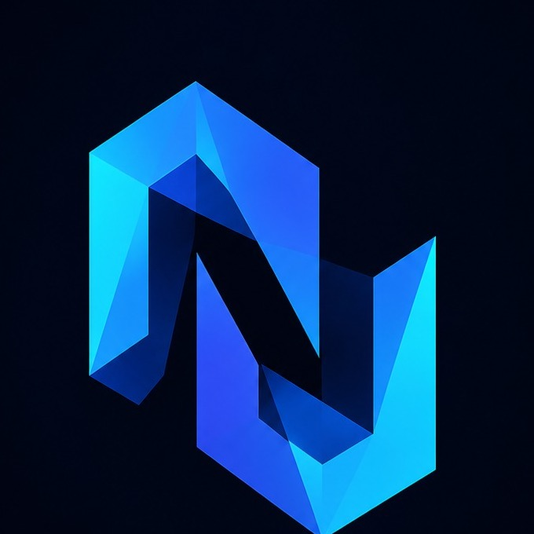

# 🚀 NEXUS Web Platform

<div align="center">



### **NEXUS — Innovation & Leadership Collective**

**Rajarambapu Institute of Technology**

A modern digital platform for innovation, collaboration, projects, events, and community building.

<br/>

[](https://nextjs.org/)
[](https://react.dev/)
[](https://www.typescriptlang.org/)
[](https://tailwindcss.com/)
[](LICENSE)

</div>

---

## ✦ About

**NEXUS** is the Innovation & Leadership Collective at Rajarambapu Institute of Technology (RIT).

This repository contains the web platform that powers NEXUS's digital presence, bringing together:

* **Recruitment** — structured applications and application management
* **Projects** — showcasing technical and engineering work
* **Events** — hackathons, workshops, and innovation initiatives
* **Team** — organizational structure and member profiles
* **Resources** — technical resources and community content
* **Communication** — official contact and social channels

Built with a focus on **performance, maintainability, accessibility, and modern UX**.

---

## ✨ Highlights

### 🎨 Experience

* Dark-first, modern interface
* Responsive across desktop, tablet, and mobile
* Motion-driven interactions
* Accessible semantic UI
* Performance-focused architecture

### ⚙️ Platform

* Next.js App Router
* React Server Components
* TypeScript throughout the codebase
* SQLite-backed recruitment system
* API route handlers
* Modular component architecture
* Environment-based configuration

### 🧩 Engineering

* Strong typing
* Reusable UI components
* Separation of data and presentation
* ESLint + TypeScript validation
* Production-ready build pipeline

---

## 🛠️ Tech Stack

| Layer     | Technology              |
| --------- | ----------------------- |
| Framework | Next.js 16              |
| UI        | React 19                |
| Language  | TypeScript              |
| Styling   | Tailwind CSS v4         |
| Animation | Framer Motion           |
| Icons     | Lucide React            |
| Database  | SQLite / better-sqlite3 |
| API       | Next.js Route Handlers  |
| Tooling   | npm, Git, ESLint        |

---

## 📁 Architecture

```text
nexus_web/
├── src/
│   ├── app/
│   │   ├── (public)/        # Public pages
│   │   ├── api/             # API routes
│   │   └── layout.tsx       # Root layout
│   │
│   ├── components/
│   │   ├── common/          # Shared components
│   │   ├── layout/          # Layout components
│   │   ├── sections/        # Page sections
│   │   └── ui/              # UI primitives
│   │
│   ├── lib/
│   │   ├── data/            # Data access
│   │   └── recruitment/     # Recruitment logic
│   │
│   ├── data/                # Static data
│   └── contexts/            # React contexts
│
├── public/                  # Static assets
├── data/                    # Local database storage
├── .env.local               # Local environment config
└── package.json
```

---

## 🚀 Getting Started

### Prerequisites

* **Node.js 18+**
* **npm**
* **Git**

### Installation

```bash
git clone https://github.com/ArSlan-Kokane/Nexus-RIT-Web.git
cd Nexus-RIT-Web
npm install
```

## 🤝 Contributing

Contributions and improvements are welcome.

```bash
git checkout -b feature/your-feature
```

Follow the existing project conventions, keep changes focused, and ensure the project passes its validation checks before opening a pull request.

---

## 👥 NEXUS

**NEXUS — Innovation & Leadership Collective**

Rajarambapu Institute of Technology
Islampur, Sangli, Maharashtra, India

For official communication:

* **Email:** [nexus@ritindia.edu](mailto:nexus@ritindia.edu)
* **Instagram:** [@nexus_rit](https://www.instagram.com/nexus_rit)
* **LinkedIn:** [NEXUS at RIT](https://linkedin.com/company/nexus-rit)
* **GitHub:** [Nexus-RIT-Web](https://github.com/ArSlan-Kokane/Nexus-RIT-Web)

---

## 📜 License

This project is available under the [MIT License](LICENSE).

---

<div align="center">

### **Built with ❤️ for NEXUS**

**Build. Lead. Connect.**

[⬆ Back to Top](#-nexus-web-platform)

</div>
